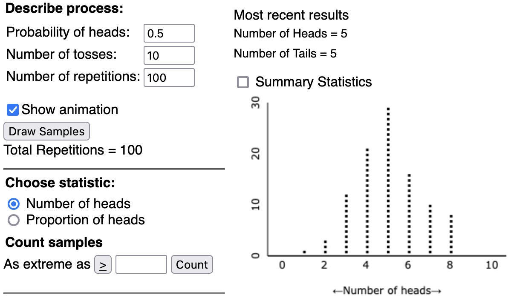
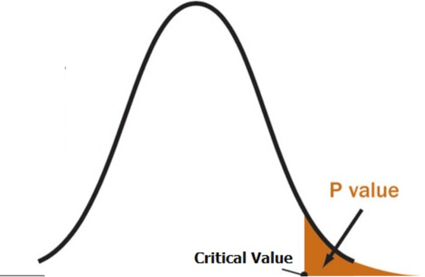
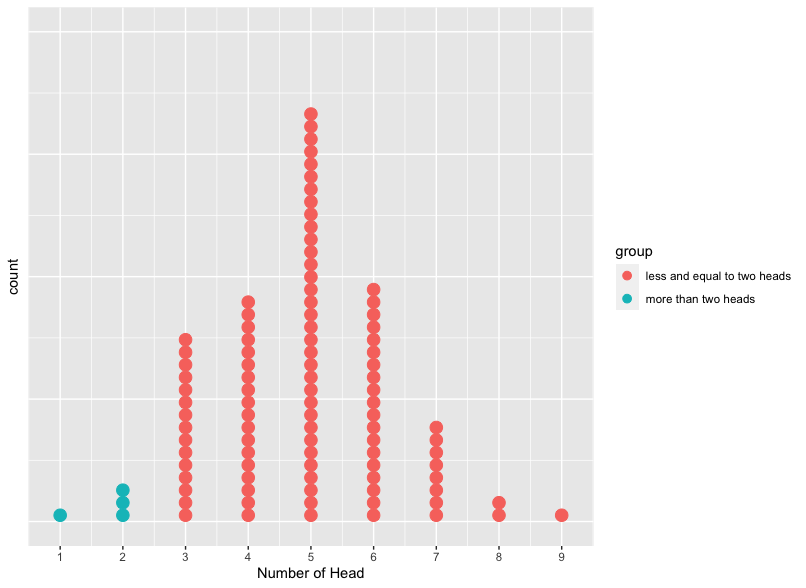
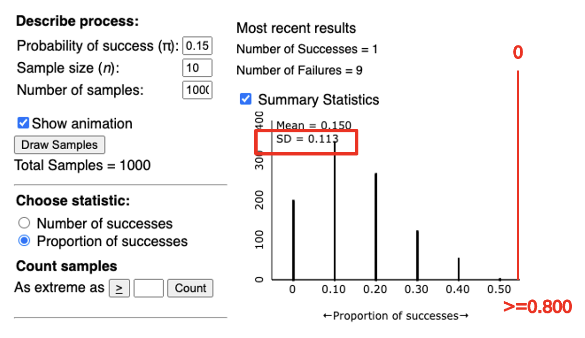
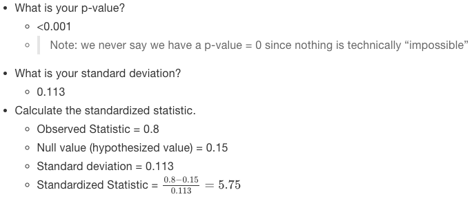
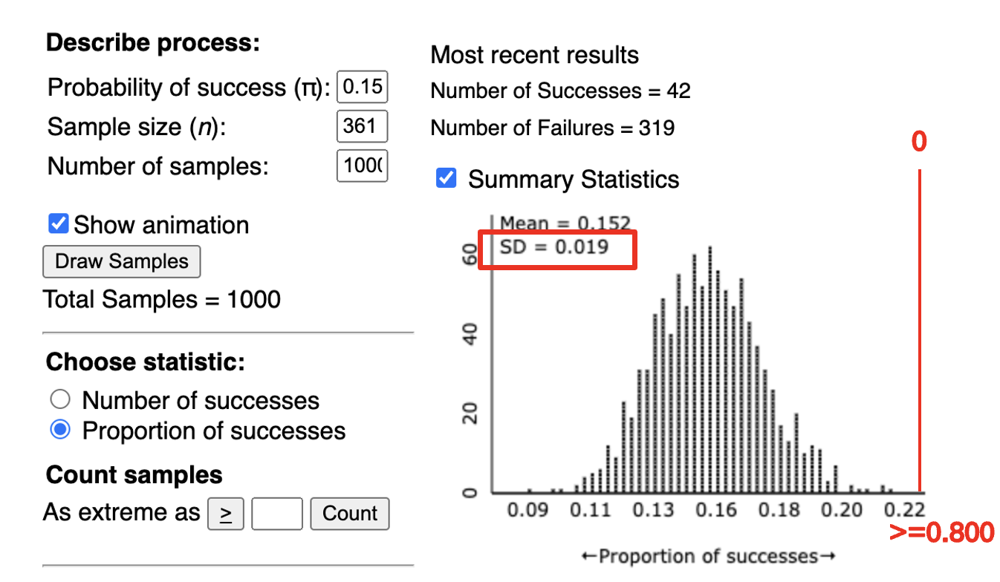
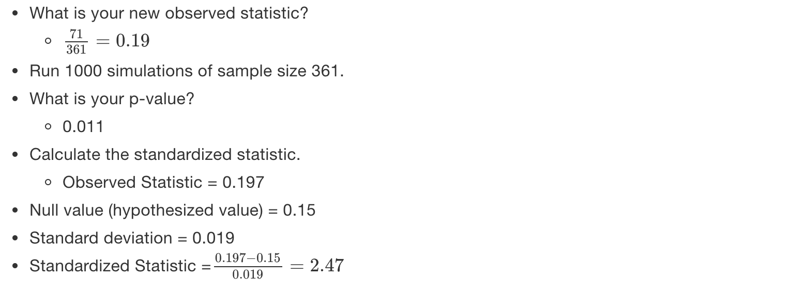
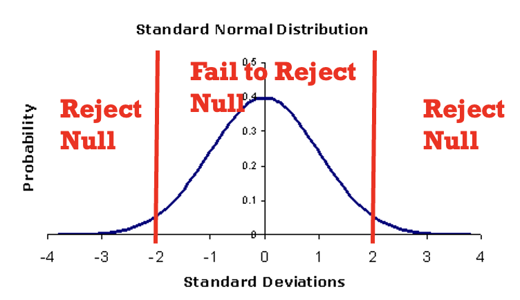
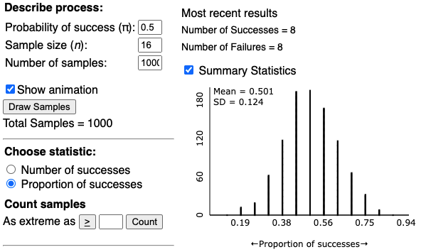
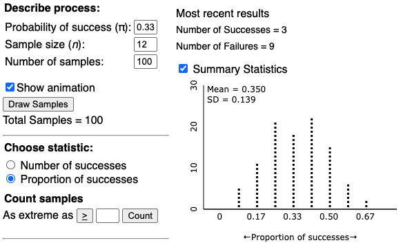

# Significance: How Strong is the Evidence?

## Intro to Chance Models
 
* Statistics – Estimate broad populations
    + No way to collect all information
    + When is a sample Statistically Significant?
* Statistical Significance
    + “Is our result unlikely to have occurred by random chance?”
    + Helper vs. Hinderer
      - Is 14/16 significantly higher than 8/16?
      - Is 10/16 significantly higher than 8/16? 
* Probability
  + Long-run proportion of times an outcome from a random process occurs 
  + Probability Distribution- Pattern of long run outcomes

### Definitions        
* **Sample**: The set of observational units on which we collect data.    
* **Sample size**: The number of observational units in the sample.    
* **Statistic**: The number summarizing the result of the sample.    
* **Population**: The complete collection of ALL elements that are of interest for a given problem.    
* **Parameter**: The long-run numerical property of the process.    

> **Population and Sample**: Use Statistics (observed from sample) to Estimate the Parameter (population unknown value).


### Symbols
* $\pi$ is the parameter- the long run proportion
    + Since it is for the population we typically do not know this value
    + This is what we are interested in
* $\hat{p}$ is the observed statistic- the value we observe from our sample
* n is the sample size

## Hypothesis Testing
* Summarize Research Question and Parameter
* $\begin{aligned}
H_O: \text{Null Hypothesis (Random Chance Model)}
\end{aligned}$
    + Chance Model
    + Equal to (=)
* $\begin{aligned}
H_A: \text{Alternative Hypothesis (There is an effect)}
\end{aligned}$
    + What researchers hope to support
    + Pick <, >, or ≠ based on what the researchers would like to show

### Hypothesis Testing Example: Coin Flipping
* Research Question: Is getting a head up as ofen as getting a tail up (Is this a fair coin)?
* Parameter (𝝅): Long run proportion of times having heads
* In Words:
    + Null: The long run proportion of times having head up is equal to 0.5. 
    + Alternative: The long run proportion of times having head up is less than 0.5. 
* In Symbols:
    + $𝐻_𝑂:𝜋=0.5$
    + $𝐻_𝐴:𝜋\not=0.5$

## 3S Strategy
1. **Statistic**: from the observed sample data    
2. **Simulate**: Identify a “by chance alone" model (chance model/null model) for scenario, and repeatedly simulate values for the statistic under that model.
3. **Strength of Evidence**: Unusual statistic? Does it fit into the pattern of the probability distribution?    
    + Unlikely: not by chance, more than guessing
    + Likely: Chance model is plausible
    
> **Simulating coin flipping (fair coin)**

From the above dot-plot, each dot represets the proportion of head resulted from each repetition comprising 10 trials of flipping a coin. Out of the 100 repetions, most of them have 4,5,6 heads (proportion 0.4, 0.5, 0.6) and fewer have above 8 (proportion 0.8) or less than 2 (proportion 0.2) heads. 

## Measuring Strength of Evidence 
### P-value


* **p-value**: The probability of obtaining a simulated value of the statistic as or more extreme than the observed statistic when the null hypothesis is true.
    + Probability: 0 < p-value < 1   
    + Finding statistics in the direction of the alternative hypothesis (less than or greater than)    
    + The smaller the p-value the larger the evidence AGAINST the null hypothesis    
* Cut offs for P-value

```{r table2, echo=FALSE, message=FALSE, warnings=FALSE, results='asis'}
tabl <- "
| P-value        | Strength of Evidence           |
|---------------|:-------------:|
| 0.10< p-value | Not much evidence against null hypothesis |
| 0.05<p-value<0.10 | Moderate evidence against the null hypothesis |
| **0.01<p-value<0.05** | **Strong evidence against the null hypothesis**     |
| p-value<0.01 | Very strong evidence against the null |
"
cat(tabl) # output the table in a format good for HTML/PDF/docx conversion
```
* Focus on cutoff of p-value < 0.05

### P-value example (Coin Flipping)
  * Each replication includes 10 trials of flipping a fair coin. The plot below summarizes 100 replications' result. (*you can find the corresponding R code file in the github file folder with name flippingCoinSimulation.R*)

* If we flip a coin 10 times and have 2 heads. 
    + What is the p-value?
      - p-value=$\frac{\text{times of replication having number of head equal and less than 2}}{\text{total number of replication}}$=$\frac{\text{number of blue dots}}{\text{total number of dots}}$=$\frac{1+3}{100}$=$0.4$
    + Do we have enough evidence to reject the hypothesis that it is a fair coin? 
      - Since p-value is no less than 0.05 (common threshold), we don't have efficient evidence to reject the null hypothesis that the coin is fair. 

### Standardized Statistics
  * Standard Deviation: Measure of how spread out data points are away from the center

  * Standardized Statistic: How far an observed statistic is from the mean of the null distribution (hypothesized value)
  * $z=\frac{\text{𝑂𝑏𝑠𝑒𝑟𝑣𝑒𝑑 𝑆𝑡𝑎𝑡𝑖𝑠𝑡𝑖𝑐−𝐻𝑦𝑝𝑜𝑡ℎ𝑒𝑠𝑖𝑧𝑒𝑑 𝑉𝑎𝑙𝑢𝑒}}{\text{𝑆𝑡𝑎𝑛𝑑𝑎𝑟𝑑 𝐷𝑒𝑣𝑖𝑎𝑡𝑖𝑜𝑛 𝑢𝑛𝑑𝑒𝑟 𝑡ℎ𝑒 𝑛𝑢𝑙𝑙}}$
  
  > Standardized Statistics Example - **Heart Transplant Operations**
  
  In an article published in the British Medical Journal (2004), researchers Poloniecki, Sismanidis, Bland, and Jones reported that heart transplantations at St. George's Hospital in London had been suspended in September 2000 after a sudden spike in mortality rate. Of the last 10 heart transplants, 80% had resulted in deaths within 30 days of the transplant. Newspapers reported that this mortality rate was over five times the national average. Based on historical national data, the researchers used 15% as a reasonable value for comparison. We would like to know whether the current underlying heart transplantation mortality rate at St. George's Hospital exceeds the national rate.
  

> 1. Run 1000 simulations of sample size 10 using the one proportion applet.
  
   

> 2. Now assume we collected a larger sample and found that 71 out of 361 patients whom received a heart transplant at St. George hospital died.



* So in both cases, the observed statistic falls **‘Z’ standard deviations above the mean of the null distribution**.

* Cut-offs for Standardized Statistics


```{r table3, echo=FALSE, message=FALSE, warnings=FALSE, results='asis'}
tabl <- "
| Z score      | Strength of Evidence           |
|---------------|:-------------:|
| z< -2 or z> 2| Strong evidence against the null hypothesis |
| z< -3 or z> 3| Very strong evidence against the null hypothesis |

"
cat(tabl) # output the table in a format good for HTML/PDF/docx conversion
```


* Normally use +/-  2 as a single cut-off.
* The farther the standardized statistic is away from zero, the stronger the evidence against the null 

  
## Doris and Buzz Example
In 1964, two dolphins (Buzz and Doris) were trained to push one of two buttons in a pool in reaction to a light. If the light flashed, the dolphins pushed the button on the left to get a fish. If the light was constant, the dolphins needed to push the button on the right. 
Once they learned this behavior, the dolphins were separated by a wall (only Doris could see the light; only Buzz could push the buttons). To get a fish, Doris would need to communicate with Buzz. 
The researcher, randomly deciding to make the light shine constant or flash, tested the dolphins’ ability to communicate. 
Out of 16 attempts, the dolphins pushed the correct button 15 times.      
Resources: http://www.bradthiessen.com/html5/stats/m300/1.pdf 


* Based on this research, to decide if Buzz and Doris are able to communicate, we need to answer the following questions:

1. State the research question.    
    + Is pushing the correct button more often than would be expected by random chance?    
2. What is the variable of interest? Identify this as categorical or quantitative.    
    + Whether or not Buzz could identify the correct button   
3. Identify the parameter:   
    + The long run proportion of times Buzz push the button the correct button and get a fish ($\pi$)   
4. State the statistic for this study. Assign a symbol to it.   
    + $\hat{p}=\frac{15}{16}=0.9375$   
5. State the null and alternative hypothesis:
    + In Words
      - Null: The long run proportion of Buzz pushing the correct button is equal to 0.5
      - Alternative: The long run proportion of of Buzz pushing the correct button is more than 0.25
    + In Symbols
      - $H_{O}:\pi=0.5$
      - $H_{A}:\pi>0.5$
6. Run a simulation with 1000 repetition with each repetition having 16 trials and $\pi=0.5$


7. Calculate the p-value based on the simulated distribution. 
   + From the plot above, it is shown that non of the 1000 repetitions has the proportion of success more than $\hat{p}=\frac{15}{16}=0.9375$. Therefore, p-value is 0.

8. Compute standardized statistics:
    + What is the observed statistics? 
      - $\hat{p}=\frac{15}{16}=0.9375$
    + Hypothesized value= 0.5
    + Standard Deviation=0.124
    +Standardized Statistics=$\frac{0.9375-0.5}{0.124}=3.528$
    
9. Based on the standardized statistic and p-value, state whether you would reject or fail to reject the null hypothesis. 
    + Reject the null hypothesis 
      - p-value < 0.05 
      - standardized statistic “outside the 2’s” 

10. Write a conclusion in context. 
    + We have evidence to conclude the long run proportion of Buzz pushing the correct button is more than 0.25.

## Rock-Paper-Scissors Example


Someone claimed that scissor is thrown the least often during a competition and observed only 2 out of 12 times a person would throw a scissor. 

1. State the research question.    
    + Is scissors thrown less often than rock and paper?    
2. What is the variable of interest? Identify this as categorical or quantitative.    
    + Whether scissor is thrown or not  
3. Identify the parameter:   
    + Long run proportion of times a person picks scissors($\pi$)   
4. State the statistic for this study. Assign a symbol to it.   
    + $\hat{p}=\frac{3}{20}=0.9375$   
5. State the null and alternative hypothesis:
    + In Words
      - Null: The long run proportion of times a person picks scissors is equal to 0.33.
      - Alternative: The long run proportion of times a person picks scissors is less than 0.33.
    + In Symbols
      - $H_{O}:\pi=0.33$
      - $H_{A}:\pi<0.33$
6. Run a simulation with 100 repetition with each repetition having 12 trials and $\pi=0.33$

7. Calculate the p-value based on the simulated distribution. 
   + From the plot above, it is shown that non of the 100 repetitions there are 21 of them having proportion throwing scissor equal to or more than $\hat{p}=\frac{2}{12}=0.17$. Therefore, p-value is $\frac{21}{100}=0.21$.

8. Compute standardized statistics:
    + What is the observed statistics? 
      - $\hat{p}=\frac{2}{12}=0.17$
    + Hypothesized value= 0.33
    + Standard Deviation=0.139
    +Standardized Statistics=$\frac{0.17-0.33}{0.139}=-1.15$
    
9. Based on the standardized statistic and p-value, state whether you would reject or fail to reject the null hypothesis. 
    + Reject the null hypothesis 
      - p-value > 0.05 
      - standardized statistic “inside the 2’s” 

10. Write a conclusion in context. 
    + We don't have sufficient evidence to conclude the long run proportion of throwing a scissor is less than 0.33.