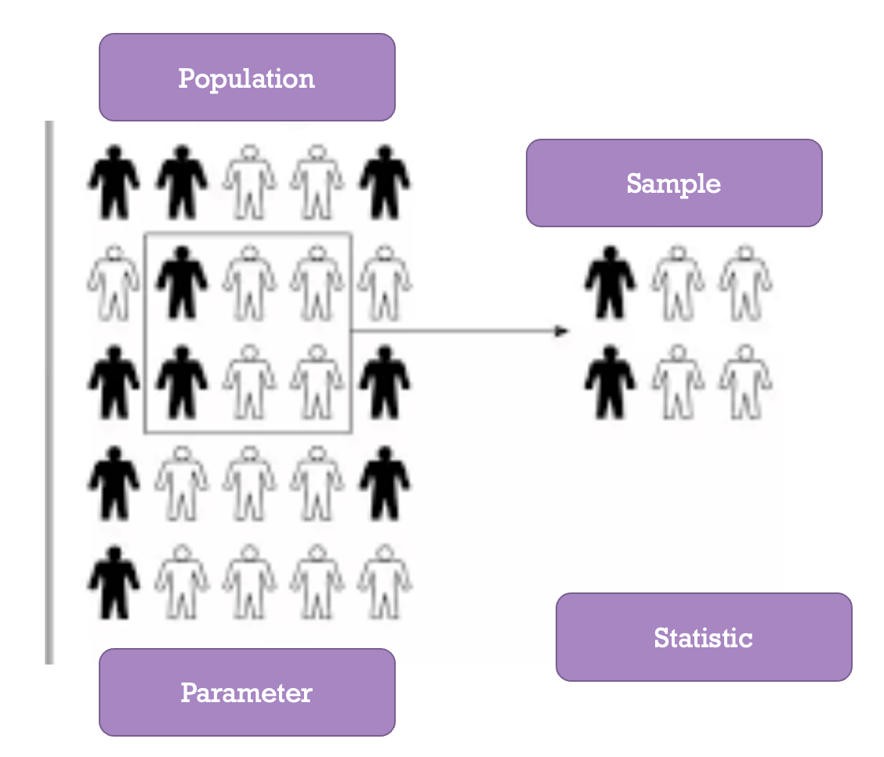

# Significance: How Strong is the Evidence? 

## Intro
 
* Statistics – Estimate broad populations
    + No way to collect all information
    + When is a sample Statistically Significant?
* Statistical Significance
    + “Is our result unlikely to have occurred by random chance?”
    + Helper vs. Hinderer
      - Is 14/16 significantly higher than 8/16?
      - Is 10/16 significantly higher than 8/16? 
* Probability
  + Long-run proportion of times an outcome from a random process occurs 
  + Probability Distribution- Pattern of long run outcomes

## Definitions        
* **Sample**: The set of observational units on which we collect data.    
* **Sample size**: The number of observational units in the sample.    
* **Statistic**: The number summarizing the result of the sample.    
* **Population**: The complete collection of ALL elements that are of interest for a given problem.    
* **Parameter**: The long-run numerical property of the process.    

> **Population and Sample**: Use Statistics (observed from sample) to Estimate the Parameter (population unknown value).

## Chance Models

### Doris and Buzz Example
### Coin Flipping Activity
## Strength of Evidence
### Rock-Paper-Scissors Example

